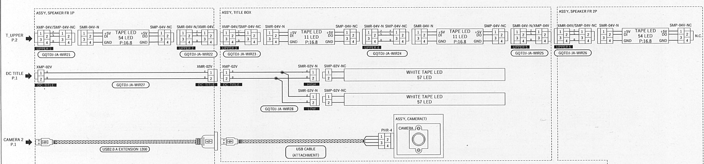
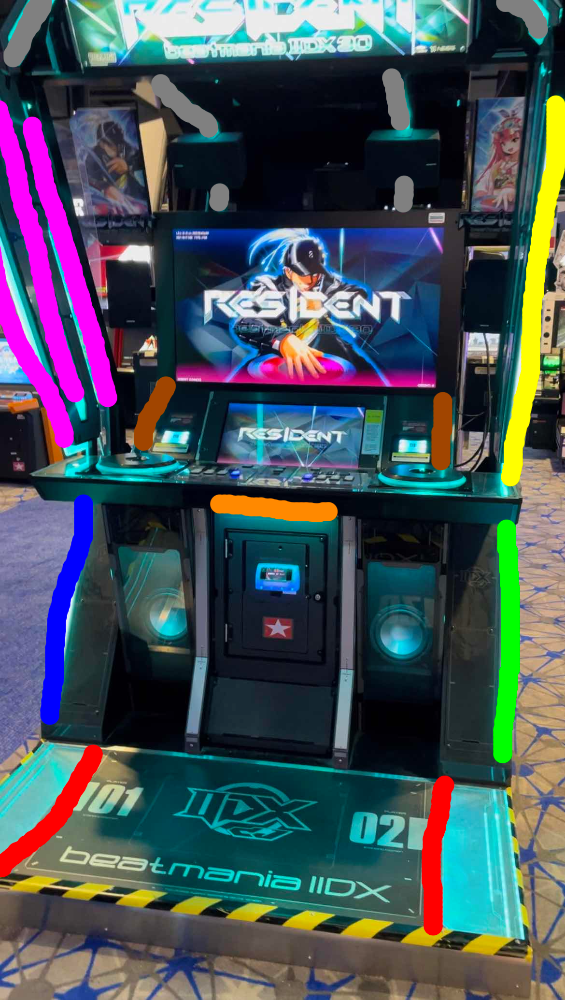
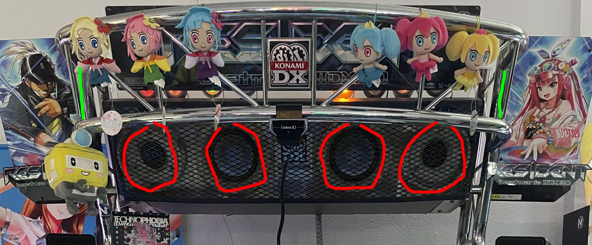

# Rough plans

[!WARNING]  
This would be necessary only if you plan on running encrypted or want to make your cab look *really* cool. otherwise, use 🏳️‍⚧️DJ 

So, the iidx lightning cab has enough lights to make a normal person blind, and as we all know, a legacy cab only has a fraction of them, and they're either neons or plain rgb, meanwhile the lightning cab uses mainly the ws2812b led chip for all the rgb stuff (except the turntables and the subwoofer leds, where they use plain rgb).

So to get some of the lightning leds to a legacy cab, we could switch out the neons on the header with some led boards or led strips from aliexpress, since they follow this pattern

in the manual, there's 4 led sections, which correspond to the gray areas on this picture

So we could use some trickery, and try to make some boards to fit in a legacy cab. The solution I was thinking of is this. where the red circles represent a neon, and the green lines represent the sides in a lightning cab. the red circles would have 27 leds each one (since there's 54 per side), and the sides would have 11 leds (to represent the title box leds)

Maaybe there could be a led board that uses the original holes of a cab, and looks legit enough, and then a diffuser to not make it as bright (although being honest, I think most people will just turn on concentration mode on their cab lol)